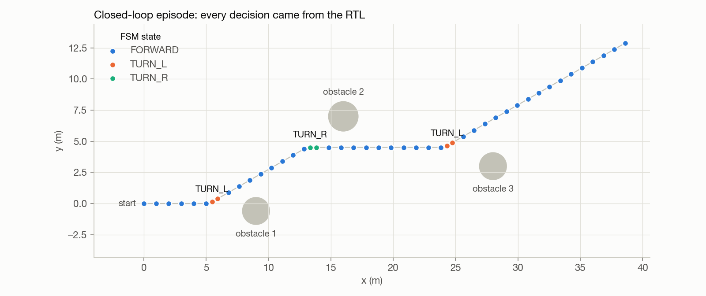
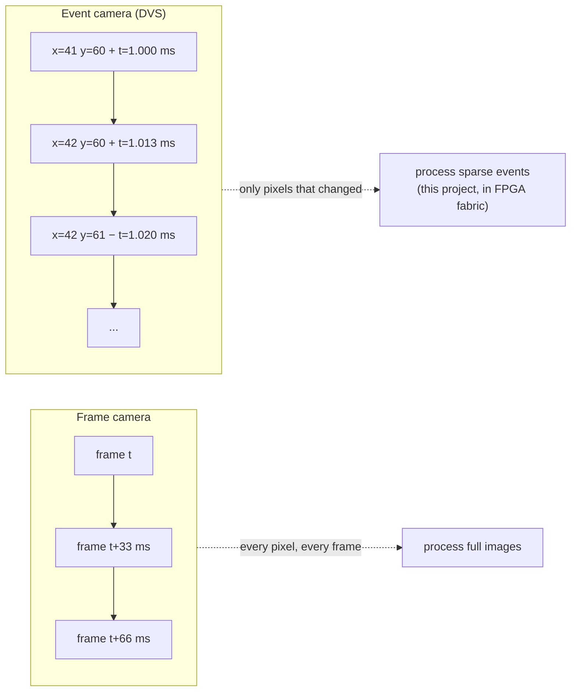
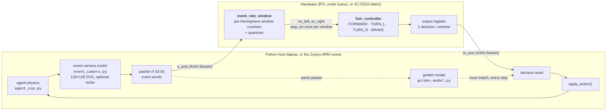
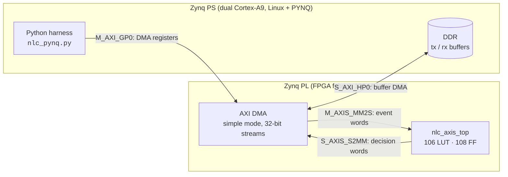
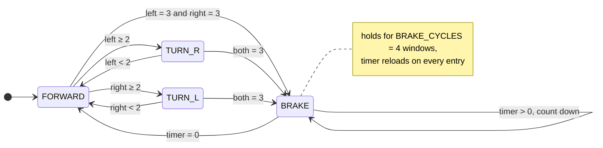
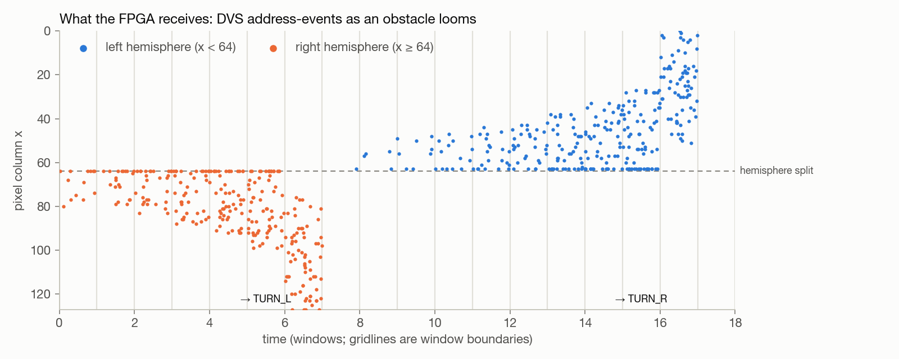
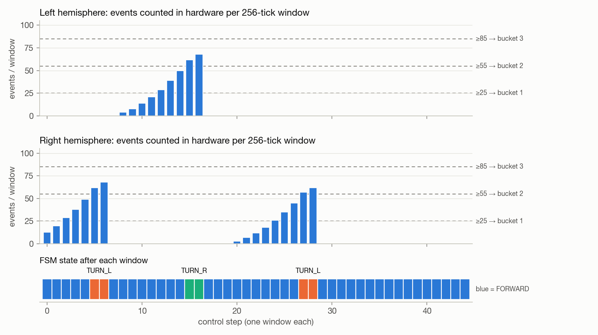
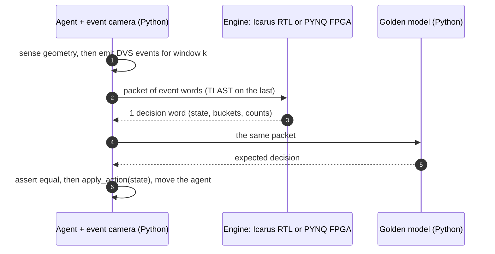
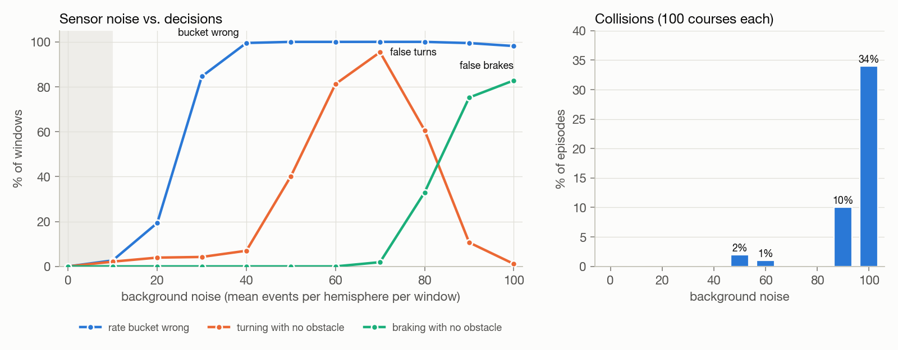

# Neuromorphic Logic Controller

[](https://neuromorphic-logic-controller-srikar-velas-projects.vercel.app)
[](https://github.com/srikarvela/neuromorphic-logic-controller/actions/workflows/ci.yml)


**An insect-inspired obstacle-avoidance controller, built as an FPGA event-processing pipeline for event cameras, and validated with hardware in the loop.**

A simulated robot carries a simulated event camera. The camera streams
pixel-level brightness-change events into an FPGA pipeline. The pipeline
counts events per hemisphere over fixed windows, turns the counts into
coarse "how much is looming on this side" levels, and a four-state finite
state machine steers away from the busier side or brakes. The pipeline is
106 LUTs of synthesizable SystemVerilog behind two AXI4-Stream ports. It
builds into a bitstream for the Zynq-7020 on a PYNQ-Z2, and a Python
harness drives it one control step at a time, either in simulation or on
the board over AXI DMA, with the same code on both paths.



**[→ Try the live browser demo](https://neuromorphic-logic-controller-srikar-velas-projects.vercel.app)**

| | |
|---|---|
| **What it is** | DVS event stream in, steering decisions out: windowed event counting, quantization, and a reactive FSM in about 100 LUTs of FPGA logic |
| **Where it runs** | RTL under Icarus Verilog, or on a PYNQ-Z2 (Zynq XC7Z020) as an overlay behind an AXI DMA |
| **How it's checked** | 163 RTL testbench checks, 21 Python tests, and a golden model that checks every hardware decision live |
| **Headline results** | The event pipeline reproduces the original rate-fed controller decision for decision. 0 collisions across 100 random courses. Tolerates about 10 background noise events per hemisphere per window. Closes timing at 100 MHz with an estimated 169 MHz Fmax |

---

## Contents

1. [Why this exists](#why-this-exists)
2. [Real-world applications](#real-world-applications)
3. [How it works](#how-it-works)
4. [A worked example: one obstacle, window by window](#a-worked-example-one-obstacle-window-by-window)
5. [Hardware-in-the-loop](#hardware-in-the-loop)
6. [Verification](#verification)
7. [Results](#results)
8. [Quickstart](#quickstart)
9. [Repository layout](#repository-layout)
10. [Limitations and roadmap](#limitations-and-roadmap)

---

## Why this exists

### Event cameras see change, not frames

A normal camera takes a full picture at a fixed rate, whether or not
anything moved. An **event camera**, also called a dynamic vision sensor
(DVS), works differently. Each pixel watches its own brightness and fires
an *event* only when the brightness changes enough. An event is a tiny
record:

```
(x, y, polarity, timestamp)      polarity = got brighter / got darker
```

The consequences matter for robots:

- **A static scene produces almost no data.** Anything that moves or looms
  produces a burst of events exactly where it happens.
- **Timing is precise.** Events are timestamped individually, typically
  with microsecond resolution, so there is no motion blur and no wait for
  the next frame.
- **Bandwidth follows activity**, not resolution times frame rate.

The raw output is a stream of address-events, not an image. Processing
that stream close to the sensor, in dedicated logic, is a natural fit for
an FPGA.



### Insects avoid obstacles without maps

Flies, bees and locusts dodge obstacles with tiny nervous systems and no
path planning. Two well-studied mechanisms inspire this controller:

- **Looming detection.** Locusts have an identified neuron, the LGMD
  (lobula giant movement detector), that fires more and more strongly as an
  object on a collision course grows in the visual field.
- **Left/right balancing.** Honeybees flying down a corridor balance the
  image motion seen by their two eyes, drifting away from the side where
  motion is stronger.

This project reduces both ideas to their simplest hardware form. It counts
change events on each half of the field of view, and steers away from the
busier half. There is no map, no path planner, no learned model, and no
memory beyond a 2-bit state register and a 3-bit brake timer. Avoidance
behavior emerges from that reflex alone.

---

## Real-world applications

The controller here is deliberately small, but the architecture, with
event sensor, near-sensor FPGA preprocessing, a reflex layer and a host in
the loop, maps directly onto real systems.

| Domain | Scenario | What this pipeline would do there |
|---|---|---|
| **Small drones** | A palm-sized quadrotor flying through a forest or warehouse, where a GPU is too heavy and too power-hungry | A reflex layer that reacts to a looming branch within a few milliseconds, independent of the slower navigation stack running on the flight computer |
| **Warehouse robots / AGVs** | An autonomous cart meets a person stepping out from behind a shelf | A hard-real-time "brake or veer" safety layer next to the main autonomy, with deterministic latency that doesn't depend on OS scheduling |
| **Automotive / ADAS** | High-dynamic-range scenes such as tunnel exits or oncoming headlights, where frame cameras saturate | Event-rate preprocessing that flags sudden looming on either side before full perception runs |
| **Industrial safety** | A robot arm cell where a hand enters the workspace | A per-zone event-rate monitor that trips a stop signal directly from hardware |
| **Space and remote sensing** | Power-constrained platforms tracking fast objects | Sparse, activity-proportional processing in a few hundred LUTs instead of full-frame pipelines |

**A concrete example.** A drone moves at 5 m/s with a small event camera
pointed forward. A pole appears slightly left of center. As it looms, the
left half of the sensor goes from a handful of events per window to
dozens. With 256-tick windows at 1 µs ticks, one window lasts 0.256 ms, and
the FPGA emits a steering decision about 3 clock cycles after each window
closes. The flight controller receives "turn right" long before a
frame-based detector would have finished processing a single image. The
autopilot stays in charge of *where* to go, and the reflex handles
*don't hit that*.

### Why an FPGA and not a CPU

- **Determinism.** Every window takes the same number of clock cycles, with
  no cache misses, garbage collection or scheduler jitter. The
  [timing table](#cycle-level-timing) is exact, not a statistical average.
- **Proximity to the sensor.** Event cameras produce a firehose of tiny
  packets. Filtering and counting them in fabric means the host only sees
  one 32-bit decision per window.
- **Size and power.** The whole pipeline is **106 LUTs and 108
  flip-flops**, about 0.2% of a Zynq-7020. It could sit beside a much larger
  perception design, or run on a very small, cheap FPGA.

---

## How it works

### System overview



The transport between host and hardware is interchangeable:

| Engine | Where the RTL runs | How packets move |
|---|---|---|
| `--engine icarus` | Icarus Verilog, one persistent simulation process | lines on stdin/stdout |
| `--engine pynq` | the Zynq-7020 fabric on a PYNQ-Z2 | AXI DMA, MM2S in and S2MM out |
| `--engine golden` | pure Python reference model | function call (cross-checking only) |

### On the FPGA



The block design (`fpga/tcl/bd_nlc.tcl`) is the minimal PYNQ streaming
pattern: the processing system, one AXI DMA, and the pipeline instantiated
directly from RTL. Vivado infers the two AXI4-Stream interfaces from
attributes on the ports.

### The event word (host → FPGA)

One AXI4-Stream beat per event, 32 bits:

| bits | 31 | 30 | 29:23 | 22:16 | 15:0 |
|---|---|---|---|---|---|
| **EVENT** | `1` | polarity | y (0–127) | x (0–127) | timestamp |
| **CTRL** | `0` | reset | `0` | `0` | timestamp |

- `x < 64` is the **left hemisphere**; `x ≥ 64` is the right.
- The timestamp's upper 8 bits are the **window id**, so a window is 256 ticks.
- A CTRL word with `reset=0` is a **sync heartbeat**. It carries a
  timestamp but counts nothing, and closes a window in which the sensor saw
  nothing. A DMA can't send an empty packet.
- A CTRL word with `reset=1` is an **in-band reset**. The FSM returns to
  FORWARD without reloading the bitstream.

### The decision word (FPGA → host)

One per closed window:

| bits | 31:24 | 23:22 | 21:20 | 19:18 | 17:15 | 14 | 13:7 | 6:0 |
|---|---|---|---|---|---|---|---|---|
| **field** | window id | `ev_left` | `ev_right` | FSM state | brake timer | stale | left count | right count |

The host gets the decision *and* the evidence behind it, so every step is
self-describing in logs.

### Stage 1: windowed event counting (`rtl/event_rate_window.sv`)

Two 7-bit saturating counters, one per hemisphere, accumulate events until
the window closes. The window closes on the first of these three triggers:

1. **A timestamp boundary.** A word arrives from a later window. This is
   replay mode, where many windows share one packet.
2. **TLAST.** The end of a DMA packet. This is closed-loop mode, where the
   host wants a decision now.
3. **An in-band reset word.**

The counts are then quantized:

| events in window | 0–24 | 25–54 | 55–84 | 85+ |
|---|---|---|---|---|
| **bucket** | 0 | 1 | 2 | 3 |

The window stage also handles the details real sensors produce:

- **Skipped windows.** If the timestamps jump ahead, each missing window is
  closed as an empty window, so the FSM still ticks once per elapsed
  window. A quiet window is real information: it lets a turn end and a
  brake count down.
- **Stale events.** A word timestamped *behind* the open window is dropped,
  and the window's `stale` flag is raised so the host can see it happened.
- **Backpressure.** A word that would close a window waits in the input
  register until the output side can accept a decision. Everything else
  keeps flowing.

### Stage 2: the reflex (`rtl/fsm_controller.sv`)



| State | Trigger | Action |
|---|---|---|
| `FORWARD` | no obstacle | drive straight |
| `TURN_R` | obstacle on the left, bucket ≥ 2 | steer right, away from it |
| `TURN_L` | obstacle on the right, bucket ≥ 2 | steer left, away from it |
| `BRAKE` | both sides at bucket 3 at once | stop for 4 windows, then re-evaluate |

The FSM has three deliberate behaviors:

- **Hysteresis.** A turn holds until *its* side drops below the obstacle
  threshold.
- **Brake priority.** A critical reading on both sides pre-empts a turn in
  progress, and the brake timer always reloads fresh.
- **A known flicker.** When the brake timer expires while the obstacle is
  still critical, the FSM spends one window in FORWARD before braking
  again. The behavior is intentional, documented and tested.

The FSM advances only on `step_en`, which the pipeline pulses exactly once
per closed window. So `BRAKE_CYCLES` counts windows, not fabric clocks.

### Cycle-level timing

Take cycle A as the cycle in which the window stage decides to close a
window. Then:

| cycle | what happens |
|---|---|
| A | window fields are registered. A closing word that had to wait is held, and `s_axis_tready` goes low |
| A+1 | `win_close` pulses: the FSM takes one step, or its registered reset drops for a reset word |
| A+2 | the new state and timer are captured into the output register |
| A+3 | `m_axis_tvalid` goes high: **the decision is on the wire 3 cycles (30 ns at 100 MHz) after the window closed** |

At most one decision is in flight at a time. If the host stops reading, the
pipeline stops accepting closing words. Nothing is dropped or duplicated.
The `tb_nlc_axis_top` testbench stalls the output to prove this.

---

## A worked example: one obstacle, window by window

The trajectory at the top of this page comes from a showcase course with
obstacles on both sides. Here is what the FPGA actually receives as the
first obstacle approaches on the right:



Each dot is one 32-bit event word. As obstacle 1 gets closer, it covers
more of the right half of the sensor, and more events fire per window. The
hardware counts them, window by window:

| window | right events | right bucket | FSM state after this window | what the robot does |
|---|---|---|---|---|
| 0 | 13 | 0 | FORWARD | drives on: too few events to matter |
| 2 | 29 | 1 | FORWARD | something is out there, not yet a threat |
| 4 | 49 | 1 | FORWARD | still below the obstacle threshold |
| **5** | **62** | **2** | **TURN_L** | 62 ≥ 55, so the right side is an obstacle: veer left |
| 6 | 68 | 2 | TURN_L | still an obstacle, and hysteresis holds the turn |
| 7 | 0 | 0 | FORWARD | turned far enough, so the right side is quiet again |

Ten windows later, obstacle 2 does the same thing on the left, and the FSM
answers with `TURN_R`. The full episode:



The whole 45-step episode is 859 event words. The host sends one packet per
step and gets exactly one decision word back each time. Every decision
matched the Python golden model.

---

## Hardware-in-the-loop

The Python harness never computes a steering decision itself. Each control
step goes like this:



The two hardware engines behave the same way:

- **Icarus.** `tb/tb_cosim_server.sv` wraps the *same* `nlc_axis_top` that
  goes on the FPGA, inside one long-running simulation. Python writes one
  line per AXI-Stream beat to its stdin, and the testbench prints each
  output beat back. State persists in the DUT's own registers between
  packets, with no testbench backdoors, just as on silicon.
- **PYNQ-Z2.** `board/pynq/nlc_pynq.py` arms the receive channel for one
  word, sends the packet through the DMA, waits for both channels with a
  timeout, and unpacks the result. It follows the same conventions as the
  crypto feed handler's PYNQ driver.

A third mode, **replay**, sends a whole recorded episode as *one* packet.
Windows then close on timestamps alone, and the hardware emits one decision
per window with no host round trip in between. On the board this measures
the pipeline's own throughput.

---

## Verification

| Layer | What is checked | Where | Checks |
|---|---|---|---|
| FSM | every transition, brake preemption from both turns, timer reload, the flicker case, `step_en` freezing state and timer | `tb/tb_fsm_controller.sv` | 53 |
| Window counter | hemisphere split, all three thresholds, saturation at 127, catch-up over skipped windows, stale drop, reset, backpressure on both close paths, id wraparound | `tb/tb_event_rate_window.sv` | 28 |
| Whole pipeline | vs an independent FSM instance: directed vectors one packet per step, 40 windows in one packet under random output backpressure, in-band reset, fully stalled output | `tb/tb_nlc_axis_top.sv` | 82 |
| Models and wire format | bit layouts, count-to-bucket parity with the old rate model over 100 001 points, golden model vs vectors, replay equals closed loop | `sim/test_event_stream.py` | 16 tests |
| RTL parity | RTL reproduces the pre-upgrade trajectory and stress sweep exactly. RTL equals golden on random multi-window streams with gaps, stale words and resets | `sim/test_parity.py` | 5 tests |
| Live | every decision in every cosim, stress, noise and replay run is compared to the golden model | `sim/cosim_driver.py` | every step |

`make unit-tb` and `make test` run all of it. CI runs both on every push,
along with a cosim episode, a replay, and stress and noise smoke tests.

### Parity with the original rate-fed controller

Before this pipeline existed, Python computed a looming *intensity* per
side and fed the FSM a bucket directly. The event camera now emits
`floor(intensity × 100)` events, and the hardware quantizes the *count* at
25, 55 and 85. Those thresholds line up exactly with the old 0.25, 0.55
and 0.85. The trajectory and stress-sweep CSVs captured from the old
design are checked in under `sim/golden/`, and the new pipeline reproduces
them exactly. Every result the project reported before still holds, with
the rate computation now in hardware.

---

## Results

### FPGA implementation

These numbers come from Vivado 2024.1 targeting `xc7z020clg400-1` at
100 MHz. The reports are in [`fpga/prebuilt/`](fpga/prebuilt/).

| | LUTs | FFs | BRAM | Timing |
|---|---|---|---|---|
| **Event pipeline** (`nlc_axis_top`) | **106** | **108** | 0 | 4.08 ns slack out of context, **Fmax ≈ 169 MHz** |
| Whole overlay (PS7 + DMA + interconnect + pipeline) | 2 756 | 3 618 | 2 | 1.25 ns slack, met. The critical path is inside the AXI interconnect, not the pipeline |

The AXI DMA and interconnect are about 25 times the size of the
controller. The part that actually processes events is tiny.

### Simulation (RTL under Icarus Verilog 12)

| check | result |
|---|---|
| RTL testbenches | 53 + 28 + 82 checks pass |
| pytest | 21 tests pass |
| default course vs pre-pipeline baseline | 45 steps, identical |
| 25-episode stress sweep vs baseline | identical per seed, 0 collisions |
| 100-episode sweeps, noise 0–40 | 0 collisions, every decision equal to golden |
| single-packet replay | 45 windows, 0 mismatches against closed loop |

### Robustness to sensor noise

Real event sensors fire spurious background events. `sim/noise_sweep.py`
adds Poisson noise to every hemisphere on every window and runs 100 random
courses per noise level, with the RTL in the loop:



| background events per hemisphere per window | what happens |
|---|---|
| **≤ 10** | **Tolerant.** Under 3% of windows get a different bucket, about 2% of clear-path windows turn needlessly, and there are no collisions |
| 20–40 | Noise alone reaches bucket 1 (≥ 25), so most buckets change. Bucket 1 isn't an obstacle, though, so false turns stay under 8% and collisions stay at 0 |
| 50–70 | Noise alone reaches bucket 2 (≥ 55), so false turns on a clear path climb from 40% to 95% of windows |
| 80–100 | Both sides reach bucket 3 at once, so false brakes climb from 33% to 83% of windows. The one-window flicker lets the robot creep forward into obstacles, and collisions reach 10% at 90 and 34% at 100 |

The takeaway is that fixed thresholds hold up to a noise floor of about 40%
of the first threshold. A real deployment would add either an
event-denoising stage in front of the counters, such as a
background-activity filter, or adaptive thresholds. Both fit naturally as
another AXI-Stream stage.

### On the board

The overlay is built, and `make board-*` is ready. The on-board run and its
DMA throughput numbers are the remaining step. See
[`docs/pynq_bringup.md`](docs/pynq_bringup.md) for the checklist and the
expected results.

---

## Quickstart

### Simulation (any machine with Icarus Verilog)

```bash
brew install icarus-verilog          # or: sudo apt install iverilog
pip install -r sim/requirements.txt  # matplotlib, pytest

make unit-tb        # three RTL testbenches
make test           # parity + model tests
make cosim          # one closed-loop episode, RTL in the loop
make stress-test    # 25 random courses
make replay-bench   # one packet, one decision per window
make noise-sweep    # robustness sweep, about 2 min
make figures        # regenerate the charts in this README
```

Every `sim/*.py` script takes `--engine {icarus,pynq,golden}`. Other
useful flags include `--noise N`, `--episodes N` and `--seed N`. Any
failing seed replays on its own with `--episodes 1 --seed <n>`.

### Building the bitstream

The free **Vivado ML Standard** edition covers the XC7Z020, so no license
is needed.

```bash
make synth-ooc      # pipeline only: utilization and Fmax, a few minutes
make bitstream      # full overlay: fpga/build/nlc.bit and nlc.hwh
```

**On an Apple Silicon Mac**, Vivado can't run natively. With Vivado
installed in a Parallels Windows VM, run this from macOS:

```bash
make vm-bitstream   # builds git HEAD inside the VM and copies results back
```

The script handles copying the tree into the VM, and retries the flaky
file reads that Vivado sometimes hits under x86 emulation. A prebuilt
overlay also lives in [`fpga/prebuilt/`](fpga/prebuilt/).

### On the PYNQ-Z2

```bash
make board-deploy BOARD_HOST=xilinx@pynq   # uses fpga/build/ or fpga/prebuilt/
make board-smoke    # reset plus two hand-built windows
make board-cosim    # the same episode, FPGA in the loop
make board-stress   # the same 25 courses on silicon
make board-bench    # replay throughput through the DMA
```

### Browser demo

```bash
cd web && npm install && npm run dev   # http://localhost:5173
```

The web app runs a parity-tested TypeScript port of the FSM, fed by the
rate model. The event pipeline is decision-for-decision identical to that
model, so the demo shows what the FPGA does.

---

## Repository layout

```
rtl/
  fsm_controller.sv       the reflex: 4-state FSM, step_en-gated
  event_rate_window.sv    windowed per-hemisphere counters + quantizer
  nlc_axis_top.sv         AXI4-Stream pipeline top
  nlc_axis_top_wrap.v     Verilog shell for Vivado IP Integrator
tb/
  tb_fsm_controller.sv    53 checks
  tb_event_rate_window.sv 28 checks
  tb_nlc_axis_top.sv      82 checks, vs an independent FSM
  tb_cosim_server.sv      persistent HIL server (stdin/stdout)
sim/
  agent_sim.py            2D agent physics + looming geometry
  event_camera.py         DVS address-event model (+ noise)
  event_stream.py         event / decision word formats
  golden_model.py         pure-Python mirror of the whole pipeline
  engines.py              icarus | pynq | golden, one interface
  cosim_driver.py         closed-loop episode
  stress_test.py          random-course sweep
  noise_sweep.py          robustness sweep
  replay_bench.py         single-packet replay
  test_*.py, golden/      pytest suites + pre-pipeline baseline CSVs
board/pynq/nlc_pynq.py    AXI DMA engine for the PYNQ-Z2
fpga/
  tcl/                    block design, bitstream build, OOC synthesis
  constraints/            PYNQ-Z2 XDC
  prebuilt/               nlc.bit / nlc.hwh + reports
scripts/                  iverilog wrappers, Parallels Vivado runner
docs/
  architecture.md         full design write-up
  pynq_bringup.md         board checklist + troubleshooting
  gen_figures.py, images/ README charts (generated from RTL runs)
web/                      React + Canvas browser visualization
```

---

## Limitations and roadmap

**Honest limitations**

- **The sensor is modeled, not rendered.** Event counts come from looming
  geometry. There is no per-pixel contrast threshold, refractory period or
  rendered scene. Only the *count* per hemisphere matters to the
  controller, so this is a fair model of what the hardware sees, but it is
  not a photoreal DVS simulation.
- **Braking is rare on open courses.** It needs both sides critical at
  once, which random courses almost never produce, so it is covered by the
  unit tests instead.
- **The prebuilt overlay was built without the TUL board files.** Its PS7
  settings are Vivado defaults rather than the PYNQ-Z2 preset. That is
  expected to be harmless under PYNQ, where the PS is configured at boot,
  but a board-file build is preferred.
- **The on-board run is pending.** The bitstream, driver and make targets
  exist. The DMA throughput number doesn't yet.

**Next steps**

1. Run on the PYNQ-Z2 and publish DMA throughput and per-window latency.
2. Add a background-activity denoising stage ahead of the counters, and
   re-run the noise sweep.
3. Add adaptive or programmable thresholds through AXI-Lite, so tuning
   doesn't need a rebuild.
4. Replay real recordings from a DVS dataset through `replay_bench.py`.
5. Compile the RTL to WebAssembly (Verilator + Emscripten), so the browser
   demo runs the real RTL.

---

See [`docs/architecture.md`](docs/architecture.md) for the full design
write-up, and [`docs/pynq_bringup.md`](docs/pynq_bringup.md) for board
bring-up.
